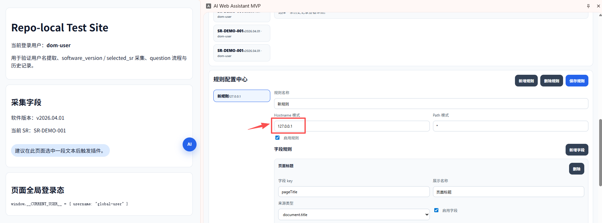

# Chrome AI Web Assistant MVP

当前主链路已切换为：`Chrome Extension MV3 Side Panel -> Python FastAPI adapter -> opencode serve`。

## 本次实现覆盖

- Python 3 adapter 作为正式后端，Extension 不再直连 `opencode serve`
- Extension 与 Python adapter 通过 SSE 流式通信
- 统一事件：`thinking / tool_call / question / result / error`
- question 通过独立 `POST /api/runs/{runId}/answers` 提交并继续原 run
- message feedback 通过 `Python adapter -> backend TS service` 主链路转发到产品级 feedback 边界
- Side Panel 支持事件流自动滚动、question 卡片交互、历史记录查看
- 浏览器主存储使用 IndexedDB（runs/events/answers）
- 用户名从网站登录态提取，支持 `unknown` 降级并记录 `username_source`
- 采集结果摘要区仅展示 `software_version` 与 `selected_sr`
- 新增 repo-local test site 用于联调
- Node mock backend 不再是主链路，仅保留迁移参考

## 目录

```text
extension/        Chrome Extension MV3 side panel
backend/          旧 Node mock backend（迁移参考，不是主链路）
python_adapter/   Python FastAPI adapter（正式主链路）
test_site/        本地联调测试站
```

## 环境要求

- Node.js 20+
- npm 10+
- Python 3.11+
- Chrome 114+
- 可选：本地 `opencode serve`，默认 `http://localhost:8123`

## 安装依赖

```bash
npm install
python -m venv .venv
. .venv/bin/activate
pip install -r python_adapter/requirements.txt
```

## 启动 Python adapter

1. 复制配置：

```bash
cp python_adapter/.env.example python_adapter/.env
```

2. 启动服务：

```bash
. .venv/bin/activate
uvicorn app.main:app --app-dir python_adapter --host 127.0.0.1 --port 8000 --reload
```

默认地址：`http://127.0.0.1:8000`

### opencode serve 配置

- 默认 `OPENCODE_BASE_URL=http://localhost:8123`
- 默认直接走真实 `opencode serve`
- 当前实现提供适配层封装：
  - `OPENCODE_GLOBAL_EVENT_ENDPOINT`
  - `OPENCODE_SESSION_ENDPOINT`
  - `OPENCODE_PROMPT_ASYNC_ENDPOINT`
  - `OPENCODE_QUESTION_LIST_ENDPOINT`
  - `OPENCODE_QUESTION_REPLY_ENDPOINT`
  - `OPENCODE_SESSION_MESSAGES_ENDPOINT`
- 若真实 opencode API 与预期不同，可通过这些变量调整，或继续扩展 `python_adapter/app/opencode_adapter.py`
- 仅当显式设置 `PYTHON_ADAPTER_USE_MOCK_OPENCODE=1` 时才走 mock 主路径
- 仅当显式设置 `PYTHON_ADAPTER_ALLOW_MOCK_FALLBACK=1` 时，真实 serve 失败后才允许回退 mock 结果

### feedback backend 配置

- Python adapter 默认通过 `FEEDBACK_BACKEND_BASE_URL=http://127.0.0.1:8787` 转发 `/api/message-feedback`
- backend TS service 继续作为点赞 / 点踩的产品级 HTTP 边界
- extension 默认仍连接 `http://localhost:8000`，由 Python adapter 暴露统一主链路入口

## 启动 test site

```bash
python3 test_site/server.py
```

访问：`http://127.0.0.1:4173`

测试站提供：

- `data-username`
- `window.__CURRENT_USER__`
- `data-software-version`
- `data-selected-sr`

## 构建 extension

1. 复制配置：

```bash
cp extension/.env.example extension/.env
```

2. 构建：

```bash
npm run build --workspace extension
```

3. Chrome 打开 `chrome://extensions`
4. 加载 `extension/dist`

## Extension 运行说明

- 在 test site 或受控业务站点上配置页面规则
- 推荐字段规则保留：
  - `software_version` -> `[data-software-version]`
  - `selected_sr` -> `[data-selected-sr]`
- 点击“采集并开始 SSE Run”
- 事件流会自动滚动
- 若出现 `question`，在卡片中选择或输入答案后提交
- 历史记录保存在 IndexedDB，可在 Side Panel 内查看详情

## 旧 Node backend 迁移说明

- `backend/` 中原有 `/api/analyze` Node mock 服务不再是主链路
- 保留该目录仅用于迁移参考、旧测试与对比
- Extension 默认已改为连接 `http://localhost:8000` 的 Python adapter
- 迁移切换完成标准：
  - Extension -> Python adapter 主链路打通
  - README / `.env.example` 默认值已指向 Python adapter
  - Node mock backend 不再出现在主流程说明中

## 常用命令

```bash
npm run test --workspace extension
npm run typecheck --workspace extension
npm run build --workspace extension
npm run test --workspace backend
python3 -m pytest python_adapter/tests
```

## 联调建议

1. 启动 Python adapter
2. 启动 test site
3. 构建并加载 extension
4. 打开 `http://127.0.0.1:4173`
5. 在 Side Panel 中保存规则并授权域名
在添加规则时，若使用测试网站，务必在Hostname 模式填写`127.0.0.1`：

6. 触发一次 run，观察：
   - `software_version` / `selected_sr` 摘要
   - thinking/tool_call/question/result 事件流
   - question 提交后继续 run
   - IndexedDB 历史记录
   - `<repo>/python_adapter/logs/invocations.jsonl` 日志落盘
   - 可先运行 `python3 python_adapter/scripts/probe_opencode.py` 探测真实 `opencode serve`

## 已知限制

- 当前仓库内未内置真实 opencode serve SDK 文档，Python adapter 对真实 serve 做了可配置适配层；mock 仅保留为显式测试/回退模式
- 浏览器环境下的真实 SSE / Chrome Side Panel 联调仍需手工验证
- `backend/` Node mock 仍存在代码与测试，但已不是默认主路径
